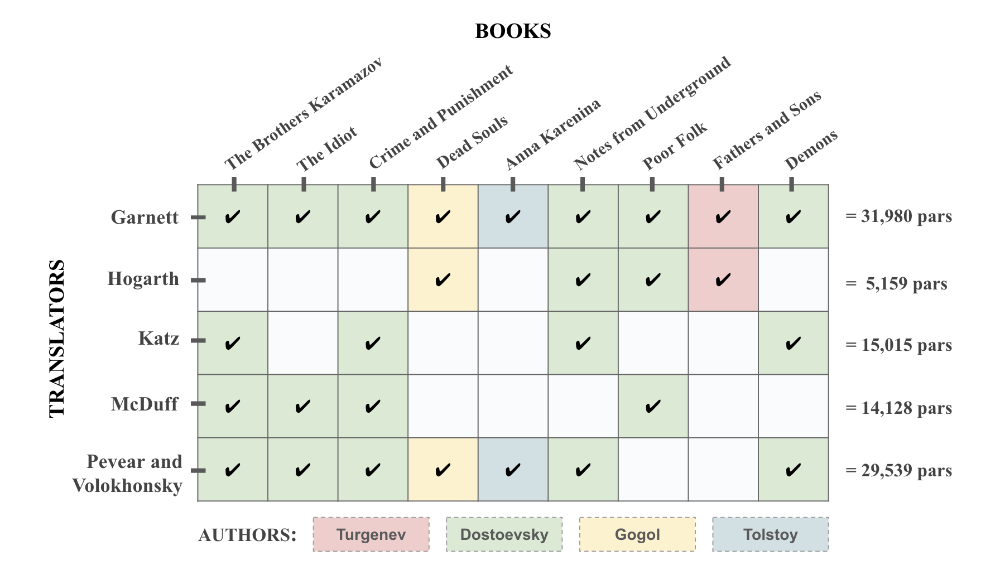
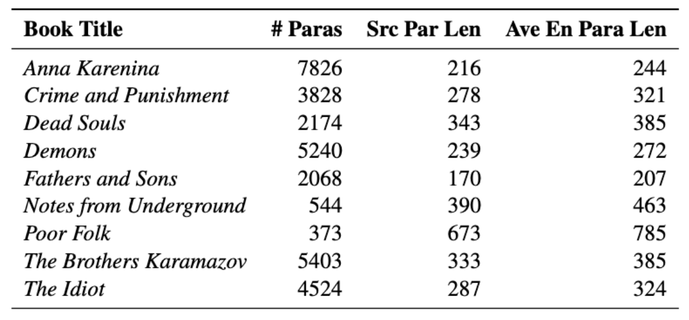

# LitMT

This repo contains the instructions for how to reproduce the literary translation dataset and experiments from our paper "An Analysis of Literary Translation Style: Examining English Translations of Russian Classics" (Katsy, Vogler, Berg-Kirkpatrick), as well as the results of our work.

## Table of Contents
  * [Our Work](#our-work)
    + [Dataset Creation + Paragraph Alignment](#dataset-creation---paragraph-alignment)
      - [Dataset Creation](#dataset-creation)
      - [Paragraph Alignment](#paragraph-alignment)
    + [Translator Classification](#translator-classification)
      - [Fine-Tuning Setup](#fine-tuning-setup)
      - [Filtering Paragraph Alignments](#filtering-paragraph-alignments)
      - [Tokenization of Input Data](#tokenization-of-input-data)
      - [Results](#results)
    + [Figurative Language Analysis](#figurative-language-analysis)
      - [Idiom Datasets](#idiom-datasets)
      - [Idiom Identification via Fuzzy Matching](#idiom-identification-via-fuzzy-matching)
  * [Code Breakdown + Instructions](#code-breakdown---instructions)
    + [Dataset Creation + Paragraph Alignment](#dataset-creation---paragraph-alignment-1)
    + [Translation Classification](#translation-classification)
    + [Figurative Language Analysis](#figurative-language-analysis-1)
  * [Russian Literary Translation Resources](#russian-literary-translation-resources)

## Our Work
### Dataset Creation + Paragraph Alignment
#### Dataset Creation
We created a new Russian-English translation style dataset, focusing on translator density: creating a dataset with multiple translations per book, where each translator has multiple translations included in the dataset.

We collected translations of 9 classic Russian literary works by 4 different authors and translated by up to 5 translators into English with 2–4 translations per work.

<div align="center">
  <a href="https://github.com/kkatsy">
     
  </a>
  <a href="https://github.com/kkatsy">
    
  </a>
</div>

<!--  -->
<!--  -->

<!--  -->
<!--  -->

#### Paragraph Alignment
In order to compare translations to each other and to the source work, text alignments must be obtained. We use the paragraph-level alignment method [par3](https://github.com/katherinethai/par3) from ["Exploring Document-Level Literary Machine Translation with Parallel Paragraphs from World Literature" (Thai et al., 2022)](https://arxiv.org/pdf/2210.14250). In this method, first the source text is translated into the target language via Google Translate (GT) to obtain sentence-to-sentence alignments and the Needleman–Wunsch algorithm is used to align the target translations to the GT text with semantic similarity scoring (Wieting et al., 2019) as the scoring guideline. Then, the target translation sentences are mapped to the source text via the source-to-GT correspondence, yielding the final paragraph alignments that are recovered by breaking the target-to-source alignments into paragraphs using the paragraph breaks of the original source text.

### Translator Classification
#### Fine-Tuning Setup
We fine-tuned a multilingual BERT model to perform 5-way translator classification. First, we create a holdout set to test classification performance consisting of two source books unseen in the train set covering all translator classes with a 80/10/10 train-val-test split, stratified by the 155 smallest translator class. As a result, we have 3547 paragraphs per class in the train set and 470 paragraphs per class in the holdout set.

#### Filtering Paragraph Alignments
We examined the performance of filtered and unfiltered paragraph alignments. For the unfiltered setting, we feed randomly sampled paragraphs to our classifier. For the filtered setting, we do the following: 1) remove aligned paragraphs that contain target translations differing from the source paragraph length by a factor of 3 (translations should be roughly same length as source), 2) calculate the mean semantic similarity score between the aligned source and target paragraphs: alignments with the top 2% and bottom 8% scores are filtered out (near-perfect similarity scores are nearly identical paragraphsand low similarity scores are likely paragraph misalignments), and 3) sample paragraphs from the filtered alignments by choosing paragraphs with the highest mean semantic similarity scores. We hypothesize that the filtered setting will outperform the unfiltered setting since the classifier is finetuned on higher-quality paragraph alignments. For both settings, we remove paragraphs shorter than 20 characters.

#### Tokenization of Input Data
Paragraph data was tokenized with the language independent, subword WordPiece tokenizer (Devlin et al., 2018). To adhere to the max token length limit for multilingual BERT, we truncated paragraphs post-tokenization. Three input options were explored: target paragraphs truncated to 256 tokens, target paragraphs truncated to 512 tokens, and concatenating target paragraphs to their corresponding source paragraph (each truncated to 256 tokens). We hypothesized that this increase performance, as it allows the model to observe interactions between the source and target translation.

#### Results
Overall, the results of our experiments confirm that a fine-tuned LLM can classify literary texts by their translators well-above chance. Since we stratify our experimental datasets by class, the expected random outcome is 20% accuracy per-class. Instead, our experiments deliver per-class accuracies in the 49% to 74% range. This result also supports our precedent for constructing our dense literary dataset: successful translator classification implies that translators produced translations with significantly different and easily observable translation styles.

<div align="center">
  <a href="https://github.com/kkatsy">
     
  </a>
  <a href="https://github.com/kkatsy">
    
  </a>
</div>

<!--  -->
<!--  -->

<!--  -->
<!--  -->


<!--  -->

### Figurative Language Analysis
#### Idiom Datasets
For preliminary idiom analysis within our dataset, we chose to use the MAGPIE dataset to study English target translations. We performed an internet search for obtain Russian idiom data. We were able to find a list of 450 Russian idioms with English translations; a list of 1650 modern Russian idioms; and a list of 650 literary Russian idioms found in Dostoevsky’s novels. We use the modern and literary Russian idioms lists to examine Russian source texts.

#### Idiom Identification via Fuzzy Matching
We used fuzzy matching with Levenshtein distance for lookup of idioms within our English and Russian idiom lists, discarding matches scores less than 90%. We do this for the English translation and Russian source texts separately. Positive results were obtained for both Russian source texts and English target translations: even with this simple method, we were able to find idiom matches in both languages. For Russian source texts, both modern and literary idioms were found, with more matches for literary over modern idioms.

<!-- 
<!--  -->

<!-- 
 -->

<div align="center">
  <a href="https://github.com/kkatsy">
     
  </a>
  <a href="https://github.com/kkatsy">
    
  </a>
</div>

## Code Breakdown + Instructions
### Dataset Creation + Paragraph Alignment
1. Obtaining Digital Books

Our dataset is composed of both non-copyrighted books (which can all be found in the **noncopyrighted_books** directory) and copyrighted translations which were purchased as Kindle books via Amazon. Links to the Kindle books on Amazon can be found in the file below.

*file:* [LitMT - Book List](https://docs.google.com/spreadsheets/d/1FgjpKv9vxqatny2Gryx_RLjGMwZ5EiJ8ugKAntYendQ/edit?usp=sharing)

2. Scanning Kindle Books with AppleScript

Download Kindle books on your Mac and open the book that you want to scan. Open `kindle_scanner.scpt` in your script editor and follow the instructions in the AppleScript file to get jpeg scans of the Kindle book pages.

*file:* `kindle_scanner.scpt`

3. OCR'ing Scans to Text

To get text out of the scanned jpeg pages, choose an OCR model of your choice. [We used Tesseract](https://github.com/tesseract-ocr/tesseract) for OCR; non fine-tuned tesseract produces text with some errors that need to be post-processed. Other options for OCR include [TrOCR](https://huggingface.co/docs/transformers/en/model_doc/trocr) and [docTR](https://github.com/mindee/doctr).

*file:* `ocr_pytesseract.py`

4. Google Translate translation of Source Text

In order to run alignment between the source and translation text, we need a Google Translate translation of the source text (Section 2.2 of the [par3 paper](https://arxiv.org/pdf/2210.14250)). This can be done through the GT API, which can be quite costly. An easier/free way is to use Google Spreadsheets for translation: copy/paste the entire book into a spreadsheet and use the `=GOOGLETRANSLATE(A2, "ru", "en")` cell command. An example is included below.

*file:* [GT Translation Example](https://docs.google.com/spreadsheets/d/1VAXqmaf_g9Y9V4qzbWQLNzIpgMnXADt-Z7U0fsXZhNw/edit?usp=sharing)

5. Text Alignment via Par3

To prepare for paragraph alignment organize create a directory for each book formatted in the following structure:
 ```
BookTitle_ru
├── src_txts
│   └── BookTitle_src.txt
└── trans_txts
    ├── BookTitle_gt.txt
    ├── BookTitle_Translator1.txt
    └── BookTitle_Translator2.txt
``` 
Pass the directory containing the book subdirectories into `run_alignment.ipynb`. Post-alignment you will get a pickle file in each book subdirectory containing the paragraph alignments. Follow the notebook instructions to re-organize the aligned data into one file containing alignments for all of the books in the dataset.

*file:* `run_alignment.ipynb`

6. Semantic Similarity Evaluation 

The quality of the paragraph alignments can be evaulated automatically using semantic similarity metrics: translations of the same source paragraph should contain the same semantic information regardless of wording. We looked at: 

- BLEU: [BLEU: a Method for Automatic Evaluation of Machine Translation](https://aclanthology.org/P02-1040.pdf)
- BERTScore: [BERTScore: Evaluating Text Generation with BERT](https://arxiv.org/pdf/1904.09675)
- BLEURT: [BLEURT: Learning Robust Metrics for Text Generation](https://arxiv.org/pdf/2004.04696)
- SIM score: [Beyond BLEU: Training Neural Machine Translation with Semantic Similarity](https://arxiv.org/pdf/1909.06694)

*file:* `alignment_eval.ipynb`

### Translation Classification
1. Experiment Dataset Generation 

Having aligned our book source and translated text and implemented paragraph sorting/filtering based on semantic similarity, we can now generate the train/val/test datasets for our translator classification experiments with multilingual-BERT. We holdout a couple books from the train dataset to create the val/test datasets; we choose the holdout books to maintain a reasonable train/val/test percentage and so that each translator is seen in both the train and holdout sets.

In our experiments we want to compare various input/data settings:
- Filtered vs unfiltered paragraph alignments - we hypothesize that removing poor alignments will improve translator classification performance.
- multilingual-BERT tokenization - we explore if passing the Russian source with its English translation improves performances compared to only passing just the English translated paragraph.

Code to perform the filtering and classification dataset generation is included in the jupyter notebook below.

*file:* `generate_exp_dataset.ipynb`

2. Running Classification 

Run translator classification with `run_classification.py` - update classification run settings in the python file. Run data is logged to wandb.

*file:* `scripts/run_classification.py`, `scripts/helpers.py`

### Figurative Language Analysis
1. Idiom Datasets 

For English idioms, we used the [MAGPIE corpus](https://github.com/hslh/magpie-corpus)
We compiled two Russian idiom lists found from sources on the web:
- Russian Contemporary Idioms: copied from one of the many lists of idioms on the web
- Russian Literary Idioms: We found a [list of idioms from Dostoevsky's *Crime and Punishment* created by a Belarusian school teacher](https://www.calameo.com/read/002288629daa1e5f14e61). No other corpus of its kind exists on the internet, as per our research. We manually copied the idioms to a text file. 

*files:* `idiom_datasets/ru_idioms.txt`, `idiom_datasets/dostoevsky_idioms.txt`

2. Idiom Exploration 

We performed automatic idiom identification on our aligned book dataset: we identified cases of both the English and Russian idioms within our dataset using rudimentary fuzzy matching. Identifying idioms within the source and translation allows us to explore how idioms were used in the source and translated literary works. 

*file:* `fig_lang_id.ipynb`

## Russian Literary Translation Resources

While creating our dataset, we researched and compiled all the existing English translations of major Russian literary works. Unfortunately, many of the translations are not digitally-available or easily-obtainable - however, perhaps that could change in the future. This data is available over the web but scattered throughout. 

Here is the complete, organized list that we compiled:[List of Translations of Major Russian Literary Works](https://docs.google.com/spreadsheets/d/1Fsw31_Gx6mfqb1bj26jXYAHsq2aHBykhDEf84foKYhc/edit?gid=0#gid=0)